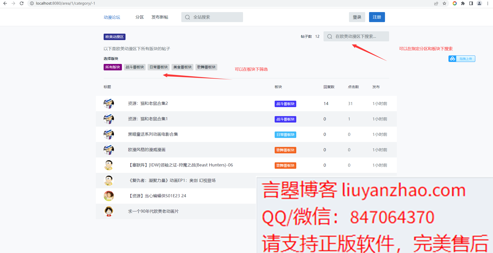
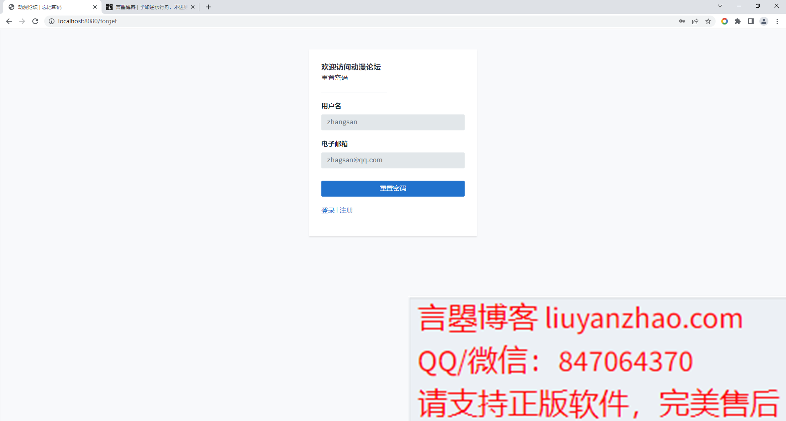

- 2022 最轻量级SSM动漫论坛
- 预览地址：[http://cartoonforum.liuyanzhao.com](http://cartoonforum.liuyanzhao.com)
- 详细介绍地址：[https://liuyanzhao.com/shop/cartoonforum.html](https://liuyanzhao.com/shop/cartoonforum.html)
- 代码地址：https://github.com/saysky/cartoonforum-ssm 或 https://gitee.com/saysky/cartoonforum-ssm
- 完成时间：2022年4月
- 该项目有SpringBoot和SSM2个版本，当前项目是SSM版本
- 博主的其他论坛项目请前往 [https://liuyanzhao.com/shop.html?k=论坛](https://liuyanzhao.com/shop.html?k=论坛)

# 一、功能介绍
- 普通用户
  - 发布帖子、帖子管理
  - 回帖
  - 个人信息修改
  - 注册、登录、找回密码

- 版主
  - 帖子管理，管理自己发布的和自己负责的版块的帖子
  - 回帖管理，管理自己发布的和自己负责的版块的帖子的回帖
  - 个人信息修改

- 管理员
  - 几乎所有功能
  - 用户管理
  - 角色管理
  - 权限管理
  - 帖子管理，管理所有帖子
  - 板块管理，设置版主
  - 分区管理
  - 回帖管理
  - 个人信息修改

# 二、技术组成
- 1、SpringBoot 或 SSM
- 2、MyBatis
- 3、Thymeleaf
- 4、Bootstrap
- 5、MySQL

0-SSM代码结构图.png

0-数据库设计ER图.png

# 三、项目截图

1-首页.png

2-根据动漫板块查询帖子.png

3-帖子详情(未登录).png
.png)
4-帖子详情(已登录).png
.png)
5-登录.png

6-注册.png

7-找回密码.png

8-分区管理.png

9-板块管理.png

10-帖子管理.png

11-帖子发布.png

12-回帖管理.png

13-用户管理.png

14-用户编辑.png

15-角色管理.png

16-角色编辑.png

17-权限管理.png

18-权限编辑.png

19-个人信息.png

20-版主后台.png

21-普通用户后台.png

# 四、联系方式
需要完整代码联系博主，微信847064370

